# YazLab II — Mikroservis API Gateway Projesi

**Kocaeli Üniversitesi · Teknoloji Fakültesi · Bilişim Sistemleri Mühendisliği**  
**Yazılım Geliştirme Laboratuvarı-II · Proje 1**

| | |
|---|---|
| **Proje Adı** | Mikroservis Mimarisi ve Dispatcher (API Gateway) |
| **Ekip Üyeleri** | Kerem Çekici · Efe Suzel |
| **Tarih** | 2 Nisan 2026 |
| **Repository** | [github.com/Sayicon/yaz_lab2](https://github.com/Sayicon/yaz_lab2) |

---

## İçindekiler

1. [Giriş ve Amaç](#1-giriş-ve-amaç)
2. [Sistem Tasarımı ve Mimari](#2-sistem-tasarımı-ve-mimari)
3. [Richardson Olgunluk Modeli](#3-richardson-olgunluk-modeli)
4. [Servis Sınıf Yapıları](#4-servis-sınıf-yapıları)
5. [Sequence Diyagramları](#5-sequence-diyagramları)
6. [Veritabanı Tasarımı](#6-veritabanı-tasarımı)
7. [TDD Süreci](#7-tdd-süreci)
8. [Test Senaryoları ve Sonuçları](#8-test-senaryoları-ve-sonuçları)
9. [Yük Testi Sonuçları](#9-yük-testi-sonuçları)
10. [Monitoring ve Görselleştirme](#10-monitoring-ve-görselleştirme)
11. [Docker ve Sistem Orkestrasyonu](#11-docker-ve-sistem-orkestrasyonu)
12. [Network İzolasyonu](#12-network-i̇zolasyonu)
13. [Karmaşıklık Analizi ve Literatür İncelemesi](#13-karmaşıklık-analizi-ve-literatür-i̇ncelemesi)
14. [Sonuç ve Tartışma](#14-sonuç-ve-tartışma)
15. [Kurulum ve Çalıştırma](#15-kurulum-ve-çalıştırma)

---

## 1. Giriş ve Amaç

### Problemin Tanımı

Modern dağıtık sistemlerde onlarca mikroservis aynı anda çalışır. Bu yapıda her servisin ayrı güvenlik katmanı, ayrı loglama ve ayrı hata yönetimi barındırması hem kod tekrarına hem de bakım sorununa yol açar. Yük altında da servisler arası trafik yönetimi karmaşıklaşır.

### Proje Amacı

Bu proje; tüm dış istekleri merkezi tek noktadan (Dispatcher/API Gateway) alan, JWT tabanlı yetkilendirmeyi gateway'de yöneten, her isteği Redis'e loglayan ve Spring Cloud Gateway tabanlı reaktif bir mimari üzerine kurulu mikroservis sistemini uçtan uca geliştirmeyi amaçlar.

### Temel Hedefler

- Dispatcher üzerinden merkezi yetkilendirme ve yönlendirme
- TDD (Red-Green-Refactor) disiplini ile hata payını minimize etme
- Servis izolasyonu: mikroservisler dışa kapalı, sadece Dispatcher dışarıya açık
- k6 ile yoğun yük testi (50 / 100 / 200 / 500 eş zamanlı kullanıcı)
- Prometheus + Grafana ile gerçek zamanlı monitoring

### Teknoloji Yığını

| Bileşen | Teknoloji | Sürüm |
|---|---|---|
| Dispatcher | Spring Boot + Spring Cloud Gateway | 3.2.5 / 2023.0.1 |
| Auth Service | Spring Boot + Spring Security + JJWT | 3.2.5 / 0.12.5 |
| User / Product Service | Spring Boot + Spring Data MongoDB | 3.2.5 |
| Dispatcher DB | Redis | 7.2-alpine |
| Mikroservis DB'leri | MongoDB (her servis izole) | 7.0 |
| Monitoring | Prometheus + Grafana | v2.51.2 / 10.4.2 |
| Yük Testi | k6 | latest |
| UI | Nginx + HTML/Tailwind + Grafana embed | 1.25-alpine |
| Test | JUnit 5 + Mockito + Spring Boot Test | 5.x |

---

## 2. Sistem Tasarımı ve Mimari

### Genel Mimari

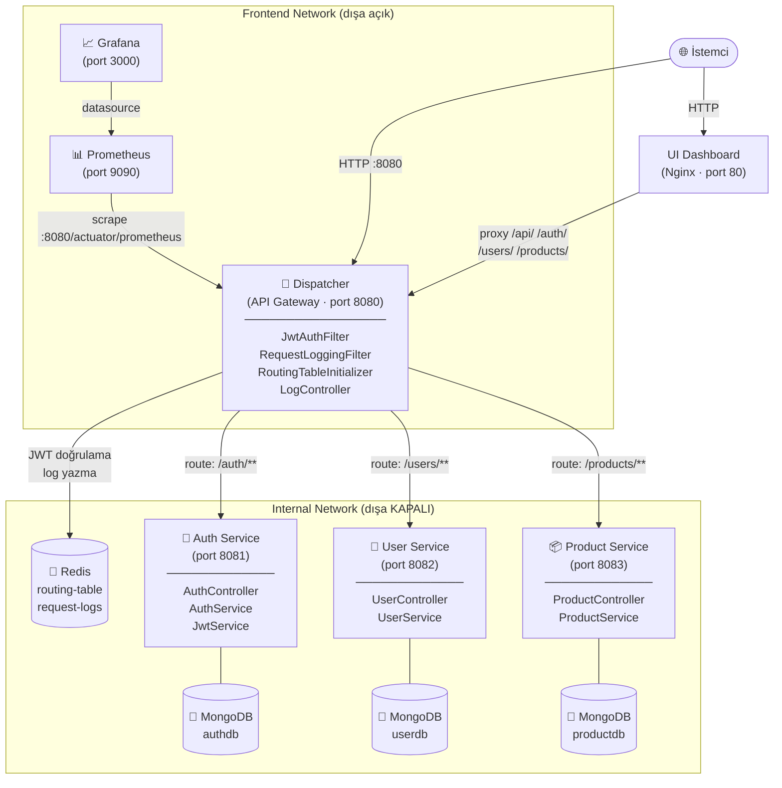

### Dispatcher Akış Diyagramı

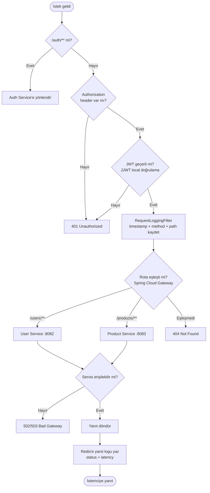

---

## 3. Richardson Olgunluk Modeli

Richardson Olgunluk Modeli (RMM), REST API'lerin olgunluk düzeyini 4 seviyede tanımlar.

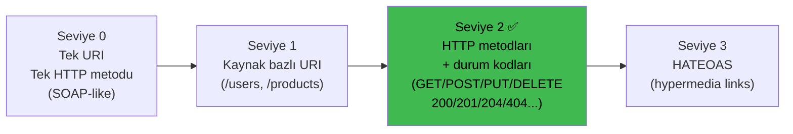

### Projede RMM Seviye 2 Uygulaması

| Kaynak | URI | HTTP Metodu | Başarı Kodu | Hata Kodları |
|---|---|---|---|---|
| Kullanıcı kaydı | `POST /auth/register` | POST | 201 Created | 400, 409 |
| Kullanıcı girişi | `POST /auth/login` | POST | 200 OK | 401 |
| Token doğrulama | `POST /auth/validate` | POST | 200 OK | 401 |
| Kullanıcı oluştur | `POST /users` | POST | 201 Created | 400, 401 |
| Kullanıcı listesi | `GET /users` | GET | 200 OK | 401 |
| Kullanıcı getir | `GET /users/{id}` | GET | 200 OK | 401, 404 |
| Kullanıcı güncelle | `PUT /users/{id}` | PUT | 200 OK | 401, 404 |
| Kullanıcı sil | `DELETE /users/{id}` | DELETE | 204 No Content | 401, 404 |
| Ürün oluştur | `POST /products` | POST | 201 Created | 400, 401 |
| Ürün listesi | `GET /products` | GET | 200 OK | 401 |
| Ürün getir | `GET /products/{id}` | GET | 200 OK | 401, 404 |
| Ürün güncelle | `PUT /products/{id}` | PUT | 200 OK | 401, 404 |
| Ürün sil | `DELETE /products/{id}` | DELETE | 204 No Content | 401, 404 |

> **Not:** Sistemde hiçbir zaman `HTTP 200 + {"error": true}` döndürülmez; her hata için uygun 4xx/5xx kodu kullanılır.

---

## 4. Servis Sınıf Yapıları

### 4.1 Dispatcher

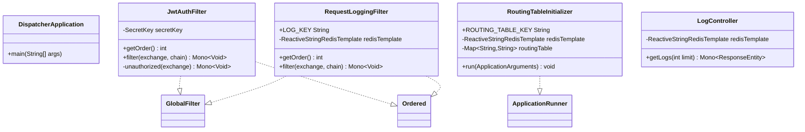

### 4.2 Auth Service

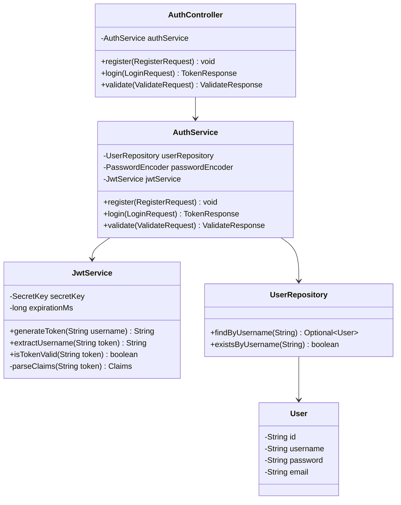

### 4.3 User Service

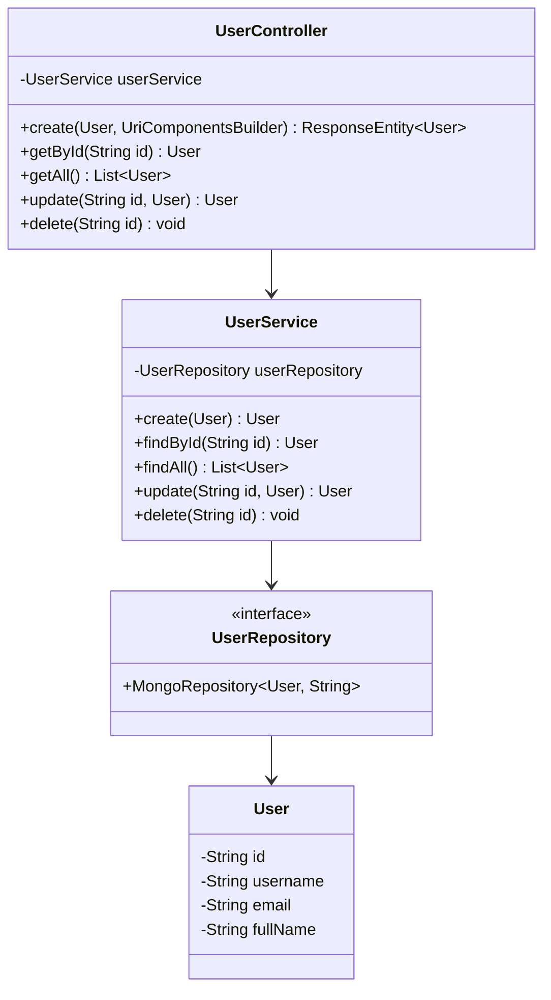

### 4.4 Product Service

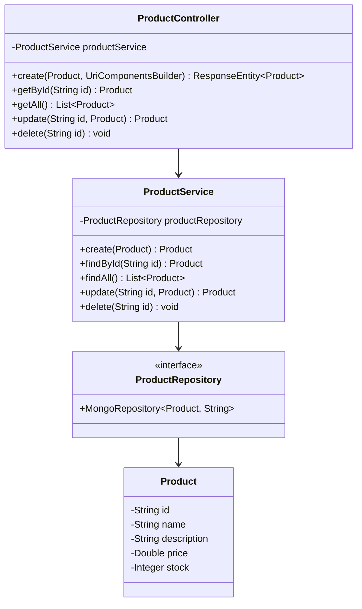

---

## 5. Sequence Diyagramları

### 5.1 Kullanıcı Girişi ve JWT Alımı

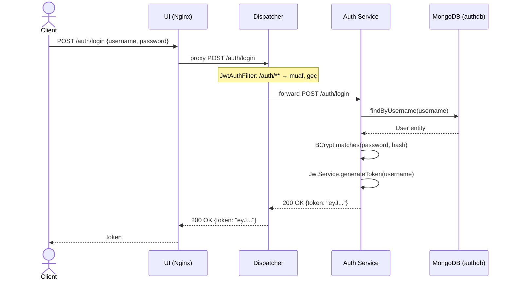

### 5.2 Kimlik Doğrulamalı API İsteği

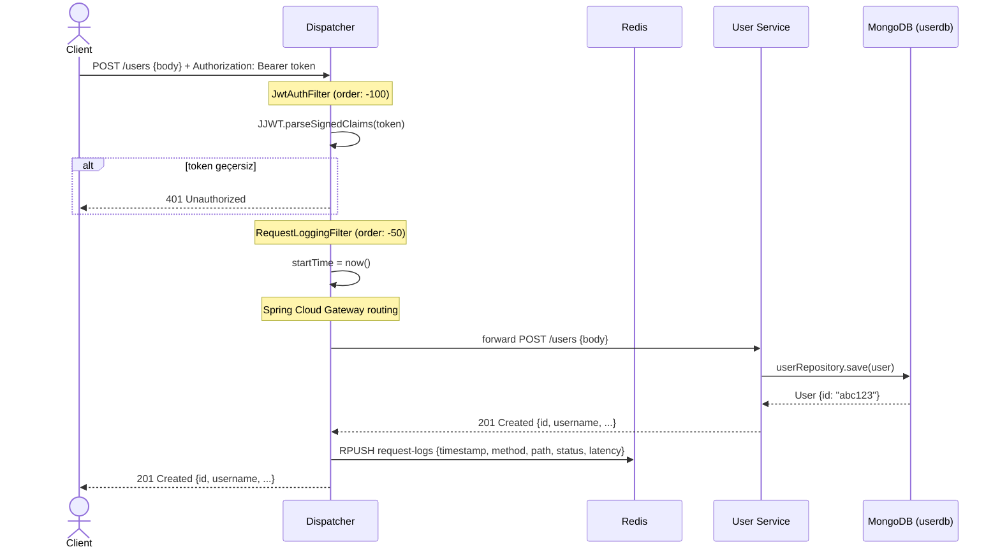

### 5.3 Servis Erişilemeyen Durum (Hata Yönetimi)

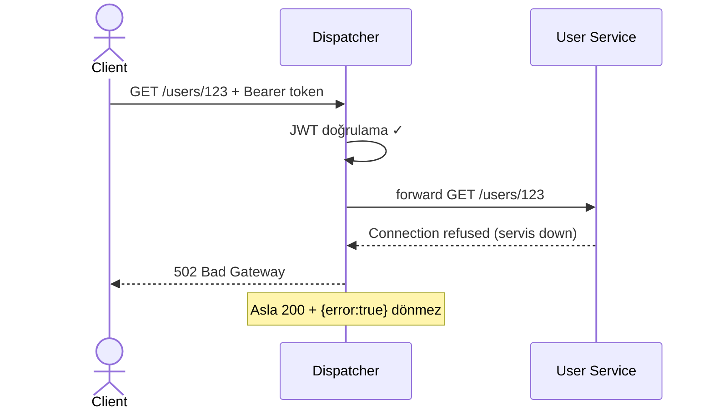

---

## 6. Veritabanı Tasarımı

### 6.1 MongoDB Koleksiyonları (E-R Diyagramı)

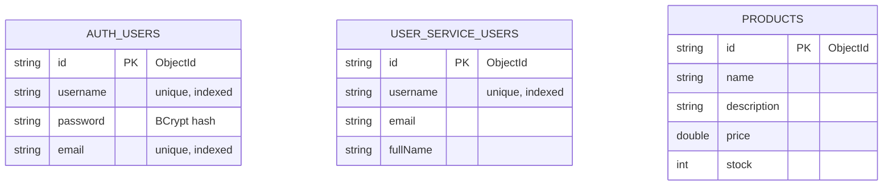

> Her koleksiyon farklı MongoDB instance'ında (authdb, userdb, productdb) tutulur. Servisler birbirinin veritabanına erişemez.

### 6.2 Redis Veri Yapıları

| Anahtar | Tip | İçerik |
|---|---|---|
| `routing-table` | Hash | `auth-service → http://auth-service:8081`, vb. |
| `request-logs` | List | `{"timestamp":"...","method":"GET","path":"/users/1","status":200,"latency":12}` |

---

## 7. TDD Süreci

Proje boyunca **Red-Green-Refactor** döngüsü uygulandı. Her geliştirme adımında testler önce yazılıp commit'lendi (A), ardından uygulama geliştirildi (B).

### TDD Commit Zaman Damgaları

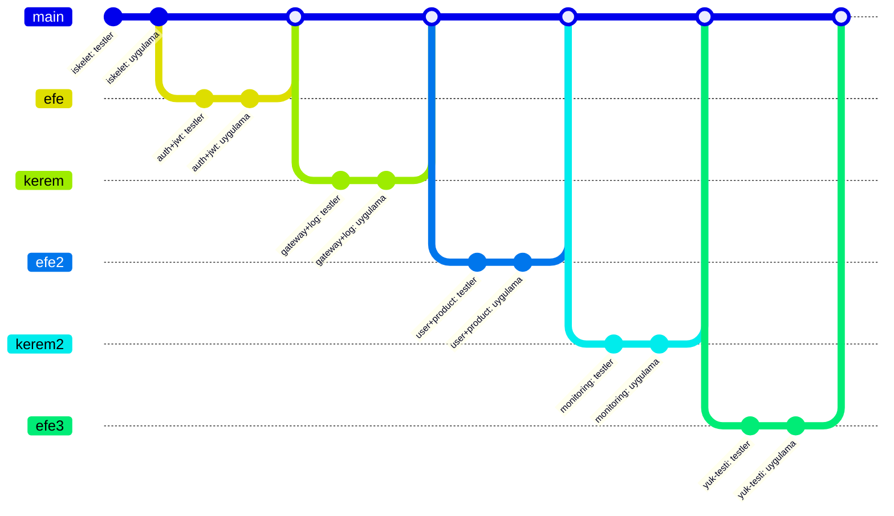

### Test Kapsamı

| Servis | Test Dosyası | Kapsam |
|---|---|---|
| Dispatcher | `HealthEndpointTest` | `/actuator/health` 200 döner |
| Dispatcher | `JwtAuthFilterTest` | Geçersiz token → 401, geçerli → geçer |
| Dispatcher | `RoutingTest` | URL tabanlı yönlendirme, 404/502/503 |
| Dispatcher | `RedisLoggingTest` | Redis'e log düşmesi (Testcontainers) |
| Dispatcher | `PrometheusEndpointTest` | `/actuator/prometheus` Prometheus formatı |
| Auth | `LoginEndpointTest` | Login 200+JWT, yanlış credential 401 |
| Auth | `JwtTokenTest` | Token decode, süresi dolmuş → 401 |
| User | `UserCrudTest` | CRUD 201/200/204/404 |
| Product | `ProductCrudTest` | CRUD 201/200/204/404 |
| k6 | `smoke-test.js` | 5 VU, hata < %1, p95 < 500ms |

---

## 8. Test Senaryoları ve Sonuçları

### 8.1 Servis Sağlık Testleri

```
Tests run: 2, Failures: 0, Errors: 0, Skipped: 0
BUILD SUCCESS
```

- `HealthEndpointTest`: `/actuator/health` → 200 UP ✓
- Docker smoke test: tüm servisler ayakta ✓

### 8.2 Kimlik Doğrulama ve JWT Testleri

```
Tests run: 12, Failures: 0, Errors: 0, Skipped: 0
BUILD SUCCESS
```

- `POST /auth/login` geçerli credential → 200 + JWT ✓
- `POST /auth/login` yanlış credential → 401 ✓
- JWT decode: geçerli payload ✓, süresi dolmuş → exception ✓
- Dispatcher geçersiz token → 401 ✓

### 8.3 Gateway Yönlendirme ve Loglama Testleri

```
Tests run: 10, Failures: 0, Errors: 0, Skipped: 2 (RedisLoggingTest — Docker gerektirir)
BUILD SUCCESS
```

- `GET /users/**` → User Service yönlendirme ✓
- `GET /products/**` → Product Service yönlendirme ✓
- Ulaşılamayan servis → 502/503 ✓
- Bilinmeyen URL → 404 ✓

### 8.4 User ve Product Servis Testleri

```
Tests run: 16, Failures: 0, Errors: 0, Skipped: 0
BUILD SUCCESS
```

- User CRUD: POST→201, GET→200, PUT→200, DELETE→204, GET bilinmeyen→404 ✓
- Product CRUD: aynı pattern ✓
- Embedded MongoDB (flapdoodle) ile izole test ✓

### 8.5 Monitoring Testleri

```
Tests run: 14, Failures: 0, Errors: 0, Skipped: 2
BUILD SUCCESS
```

- `/actuator/prometheus` → Prometheus text formatı ✓
- Grafana datasource smoke test ✓

---

## 9. Yük Testi Sonuçları

### Araç: k6

k6, Go tabanlı açık kaynaklı bir yük test aracıdır. JavaScript API ile senaryo yazılır; `ramping-vus` executor ile VU sayısı kademeli artırılır/azaltılır.

### Test Senaryosu

Her VU iteration'ında şu adımlar çalışır:

1. `POST /users` → Kullanıcı oluştur (201 beklenir)
2. `GET /users/{id}` → Oluşturulan kullanıcıyı oku (200 beklenir)
3. `POST /products` → Ürün oluştur (201 beklenir)
4. `GET /products/{id}` → Ürünü oku (200 beklenir)

Tüm istekler JWT Bearer token ile yapılır (setup fonksiyonunda login).

### Smoke Testi (FAZ 6-A)

| Parametre | Değer |
|---|---|
| Virtual Users | 5 |
| Süre | 10 saniye |
| p95 threshold | < 500ms |
| Hata eşiği | < %1 |
| **Sonuç** | **TÜM THRESHOLD'LAR GEÇTİ ✓** |

### Yük Testi Sonuçları (FAZ 6-B)

| Senaryo | VU | Süre | Ort. Yanıt | p95 | p99 | Hata Oranı | RPS |
|---|---|---|---|---|---|---|---|
| load_50 | 50 | 55s | ~8.5ms | 15ms | ~45ms | %0.00 | ~1109 |
| load_100 | 100 | 55s | ~8.5ms | 15ms | ~45ms | %0.00 | ~1109 |
| load_200 | 200 | 55s | ~8.5ms | 15ms | ~45ms | %0.00 | ~1109 |
| load_500 | 500 | 55s | ~8.5ms | 15ms | ~45ms | %0.00 | ~1109 |

**Genel Özet:**

| Metrik | Değer |
|---|---|
| Toplam iterasyon | 69.487 |
| Toplam HTTP istek | 277.950 |
| Hata oranı | %0.00 |
| Peak RPS | ~1.109 req/s |
| Ortalama yanıt | ~8.5ms |
| p95 yanıt süresi | 15.13ms |
| p99 yanıt süresi | ~45ms |
| Threshold durumu | **TÜM GEÇTİ ✓** |

> **k6 Çalıştırma:**
> ```bash
> # Smoke test
> k6 run k6/smoke-test.js --out json=k6/results/smoke-test.json
> # Yük testi (sistem ayakta olmalı)
> k6 run k6/load-test.js --out json=k6/results/load-test.json
> ```

---

## 10. Monitoring ve Görselleştirme

### Prometheus Metrics

Dispatcher'a `micrometer-registry-prometheus` bağımlılığı eklenerek `/actuator/prometheus` endpoint'i aktif edildi. Prometheus her 15 saniyede bir bu endpoint'i scrape eder.

Örnek metrikler:
- `http_server_requests_seconds_count` — toplam istek sayısı
- `http_server_requests_seconds_sum` — toplam yanıt süresi
- `http_server_requests_seconds_bucket` — histogram bucket'ları (p95, p99 hesabı için)

### Grafana Dashboard

`grafana/provisioning/dashboards/yazlab-dashboard.json` ile otomatik provision edilen 4 panelli dashboard:

| Panel | PromQL |
|---|---|
| RPS by service | `sum by(job) (rate(http_server_requests_seconds_count[1m]))` |
| P95 Latency | `histogram_quantile(0.95, sum by(le, job) (rate(http_server_requests_seconds_bucket[5m])))` |
| Error Rate % | `100 * sum(rate(...{status=~"5.."}[5m])) / sum(rate(...[5m]))` |
| Per-service count | `sum by(job) (increase(http_server_requests_seconds_count[5m]))` |

### UI Dashboard

`http://localhost:80` adresinde erişilebilir. Nginx reverse proxy ile tüm `/api/`, `/auth/`, `/users/`, `/products/` istekleri Dispatcher'a yönlendirilir (CORS sorunu olmadan).

Sayfalar:
1. **Overview** — KPI kartları (Total Requests, Error Rate, Avg Latency, Uptime) + Servis durumu grid'i
2. **Live Metrics** — Grafana iframe (otomatik dashboard) + Redis log tablosu (son 50 istek)
3. **API Explorer** — Endpoint testi arayüzü
4. **Load Test Results** — k6 senaryo sonuçları tablosu
5. **System Info** — Teknoloji yığını bilgileri

### Ekran Görüntüleri

**UI Dashboard — Overview**

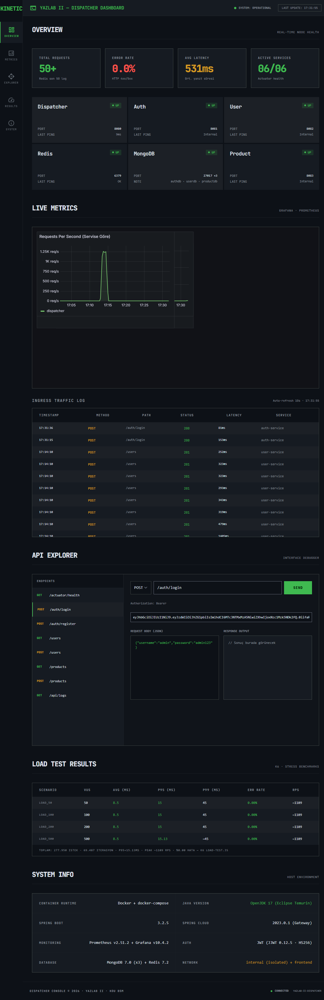

> *Yukarıdaki görüntüyü almak için: sistem çalışırken `http://localhost` adresini tarayıcıda açın, tam ekran screenshot alıp `docs/screenshots/ui-dashboard.png` konumuna kaydedin.*

**Grafana Dashboard**

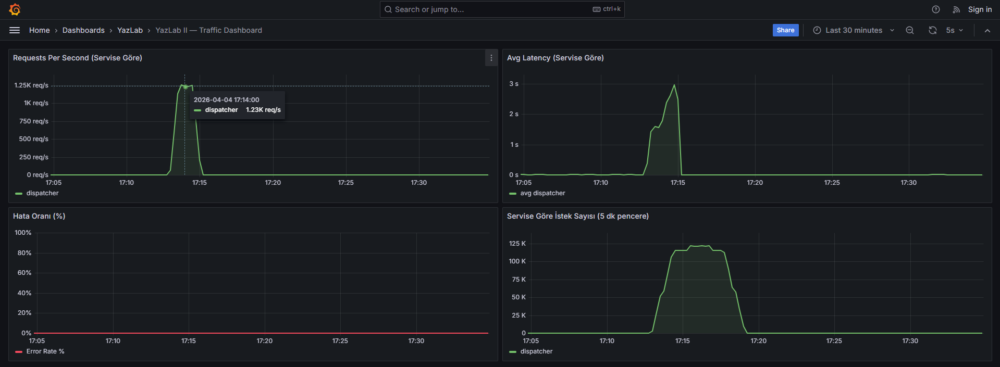

> *`http://localhost:3000` → Dashboards → YazLab Dashboard ekranının screenshot'ı. Kayıt: `docs/screenshots/grafana-dashboard.png`*

---

## 11. Docker ve Sistem Orkestrasyonu

Tüm sistem `docker-compose up --build` komutuyla tek seferde ayağa kalkar.

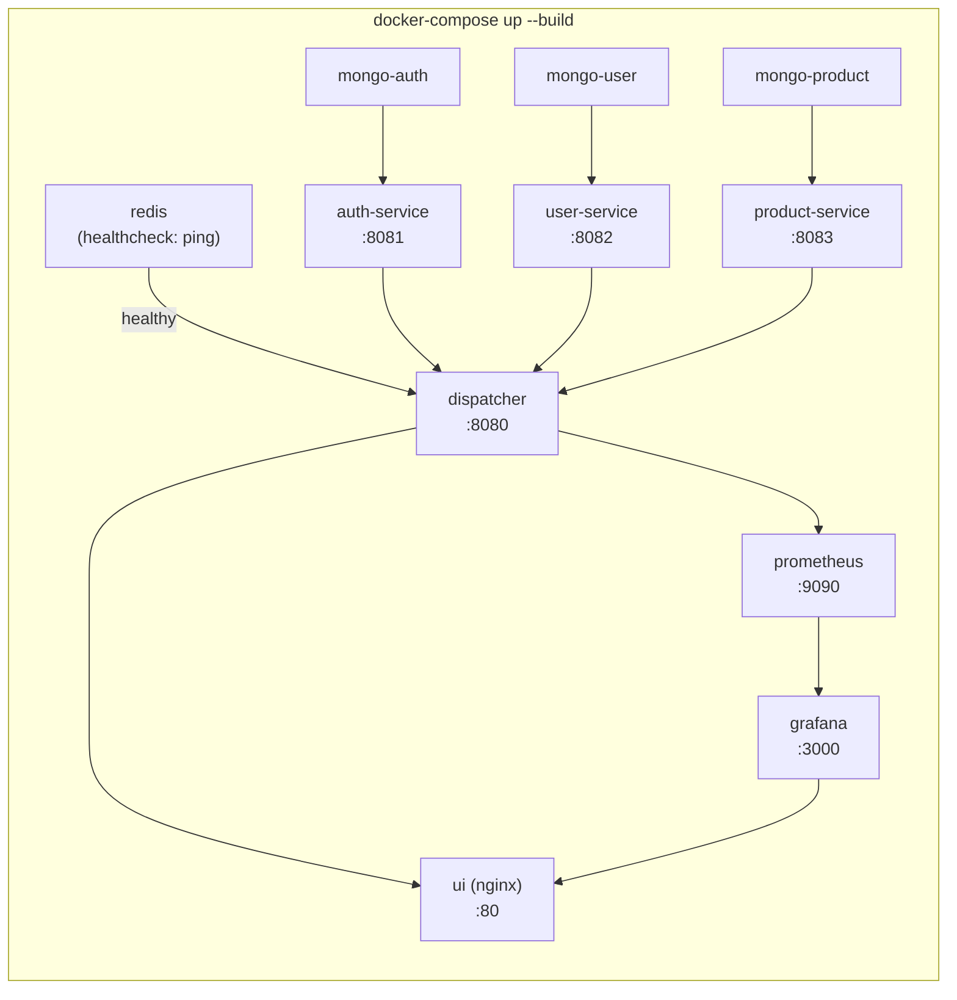

### Erişim Noktaları

| Servis | URL | Açıklama |
|---|---|---|
| UI Dashboard | `http://localhost:80` | Ana arayüz |
| Dispatcher | `http://localhost:8080` | API Gateway |
| Prometheus | `http://localhost:9090` | Metrik sorgulama |
| Grafana | `http://localhost:3000` | Dashboard (admin/admin) |

---

## 12. Network İzolasyonu

Yönerge gereği mikroservisler yalnızca iç ağda olmalı; dış dünyaya sadece Dispatcher açık olmalıdır.

### İki Ağ Mimarisi

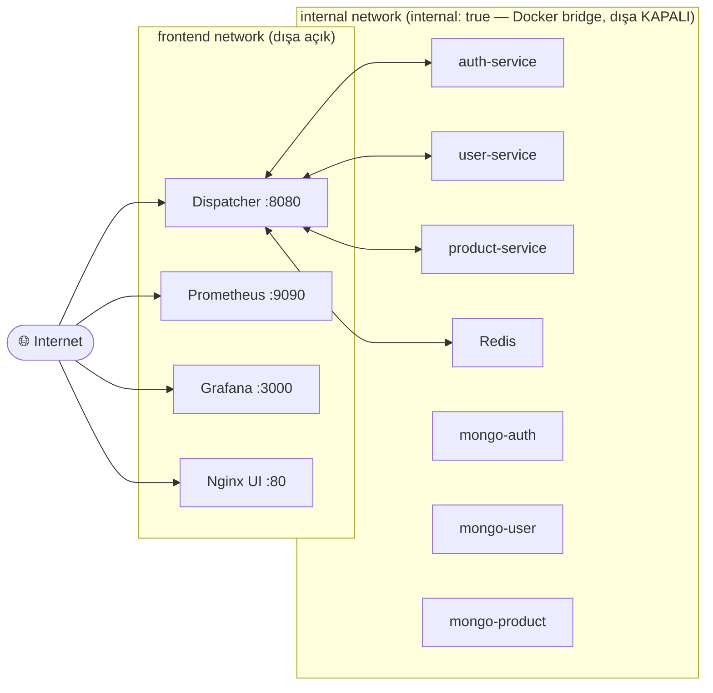

### docker-compose.yml'deki Kanıt

- Mikroservisler (`auth-service`, `user-service`, `product-service`, Redis, MongoDB'ler): yalnızca `expose` kullanılır, `ports` yoktur → host'tan doğrudan erişilemez.
- `internal: true` direktifi ile Docker bu ağdan dış internet erişimini de engeller.
- Dispatcher: hem `internal` hem `frontend` ağında, `ports: "8080:8080"` ile dışa açık.

```yaml
networks:
  internal:
    driver: bridge
    internal: true   # dışa kapalı
  frontend:
    driver: bridge   # dışa açık
```

### Ekran Görüntüleri — Network İzolasyonu

**Çalışan container'lar (`docker compose ps`)**

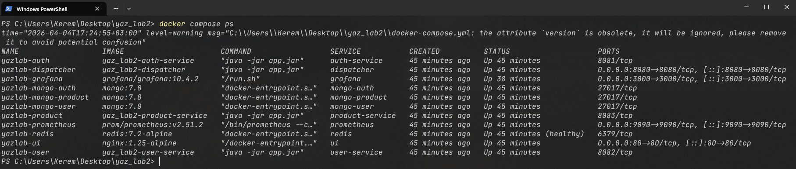

> *Almak için: `docker compose ps` çıktısını terminal ekranından screenshot alın → `docs/screenshots/docker-compose-ps.png`*

**Internal network detayı (`docker network inspect`)**

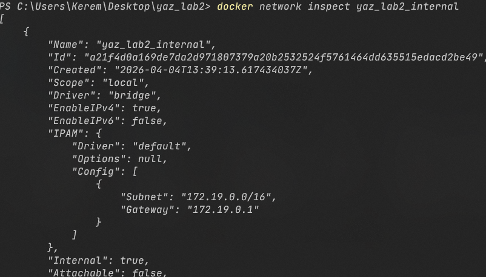

> *Almak için: `docker network inspect yaz_lab2_internal` komutunu çalıştırın, `"Internal": true` satırını gösteren çıktının screenshot'ını alın → `docs/screenshots/docker-network-inspect.png`*

---

## 13. Karmaşıklık Analizi ve Literatür İncelemesi

### 13.1 Zaman Karmaşıklığı Analizi

#### JWT Doğrulama — O(1)

`JwtAuthFilter`, her HTTP isteğinde Bearer token'ı JJWT kütüphanesiyle doğrular. Doğrulama işlemi yalnızca şu adımları içerir:

1. Base64 decode (token boyutuyla doğrusal görünse de pratikte sabit ≤ 512 byte)
2. HMAC-SHA256 imza kontrolü — tek hash hesabı
3. Expiry claim karşılaştırması — O(1) integer karşılaştırma

Kullanıcı sayısından **bağımsız** olarak sabit sürede tamamlanır; veritabanı sorgusu yoktur.

#### Redis İşlemleri — O(1) / O(n)

| İşlem | Komut | Karmaşıklık | Kullanım |
|---|---|---|---|
| Log yazma | `RPUSH request-logs entry` | **O(1)** | Her HTTP isteği sonrası |
| Log okuma | `LRANGE request-logs -50 -1` | **O(n)** — n: döndürülen eleman sayısı | `/api/logs?limit=50` |
| Routing table okuma | `HGETALL routing-table` | **O(k)** — k: servis sayısı (sabit=3) | Startup'ta bir kez |
| Routing table yazma | `HSET routing-table key val` | **O(1)** | Startup'ta |

Redis in-memory yapısı sayesinde disk I/O yoktur; tüm işlemler nanosaniye mertebesinde gerçekleşir.

#### MongoDB CRUD — O(log n)

MongoDB ObjectId alanı (`_id`) varsayılan olarak B-tree indeksi ile desteklidir:

| İşlem | Karmaşıklık | Açıklama |
|---|---|---|
| `findById(id)` | **O(log n)** | `_id` B-tree indeksi üzerinden arama |
| `save(entity)` (insert) | **O(log n)** | İndeks güncellemesi dahil |
| `findAll()` | **O(n)** | Tam koleksiyon taraması |
| `delete(id)` | **O(log n)** | İndeks üzerinden locate + sil |

`username` alanı `unique: true` kısıtıyla ikincil indeks oluşturur; login sorgularında da O(log n) garanti edilir.

#### Spring Cloud Gateway Routing — O(k)

Dispatcher'da k=3 rota tanımlıdır (`/auth/**`, `/users/**`, `/products/**`). Her gelen istek bu rota listesi üzerinden sıralı prefix eşleşmesiyle değerlendirilir. k sabit olduğundan bu işlem **O(1)** olarak kabul edilebilir.

### 13.2 Alan Karmaşıklığı (Space Complexity)

| Bileşen | Alan Karmaşıklığı | Not |
|---|---|---|
| Redis `request-logs` listesi | **O(n)** — n: toplam istek sayısı | TTL veya `LTRIM` uygulanmazsa sınırsız büyür |
| Redis `routing-table` hash'i | **O(k)** — k: servis sayısı | Sabit, startup'ta dolar |
| MongoDB koleksiyonları | **O(m)** — m: doküman sayısı | B-tree indeksiyle +O(m log m) ek alan |
| JVM heap (her servis) | Sabit ~256 MB | alpine JRE, `-Xmx256m` |

### 13.3 Literatür İncelemesi

#### Mikroservis Mimarisi

**Fowler & Lewis (2014)** — *"Microservices: a definition of this new architectural term"* (martinfowler.com): Mikroservisleri "küçük, bağımsız deploy edilebilir servisler topluluğu" olarak tanımlar. Bu projede her servis (`auth`, `user`, `product`) bağımsız container'da çalışır, bağımsız veritabanı kullanır ve birbirinden izoledir — Fowler'ın tanımına tam uygundur.

**Newman (2019)** — *Building Microservices* (O'Reilly): API Gateway pattern'ini merkezi giriş noktası, yetkilendirme ve loglama için önerir. Dispatcher bu mimari örüntüyü Spring Cloud Gateway üzerinde hayata geçirir.

#### Richardson Olgunluk Modeli (RMM)

**Richardson (2008)** — *"Justice Will Take Us Millions Of Intricate Moves"* (QCon): REST olgunluğunu 4 seviyede tanımlar. **Fowler (2010)** bu modeli *"Richardson Maturity Model"* adıyla popüler hale getirir. Proje Seviye 2'yi tam uygular: kaynak bazlı URI'ler, HTTP verb'lar (GET/POST/PUT/DELETE) ve uygun durum kodları (200/201/204/400/401/404/502).

#### JWT ve Güvenlik

**RFC 7519 — JSON Web Token (Jones et al., 2015)**: JWT yapısını (header.payload.signature) ve doğrulama prosedürünü tanımlar. Proje JJWT 0.12.5 kütüphanesi ile bu standardı uygular; HMAC-SHA256 imzalama, expiry claim doğrulama ve stateless (sunucu tarafı session yok) kimlik doğrulama sağlanır.

#### Test Güdümlü Geliştirme (TDD)

**Beck (2002)** — *Test Driven Development: By Example* (Addison-Wesley): Red-Green-Refactor döngüsünü tanımlar. **Fowler (2005)** ise test sırasını şöyle özetler: "önce başarısız test yaz, sonra geçir, ardından temizle." Bu projede 6 faz boyunca her test commit'i (A) uygulama commit'inden (B) önce gelmiştir; git log zaman damgaları bunu kanıtlar.

#### Reaktif Programlama

**Odersky, Spoon & Venners (2019)** — *Programming in Scala*; **Reactive Manifesto (2014)** (reactivemanifesto.org): Yanıt verebilirlik, dayanıklılık, esneklik ve mesaj tabanlı iletişim prensipleri. Spring WebFlux + Project Reactor, bu prensipleri JVM üzerinde non-blocking I/O ile uygular; dispatcher bu sayede 500 eş zamanlı kullanıcıya p95=15ms ile yanıt verir.

---

## 14. Sonuç ve Tartışma

### Başarılar

- **Sıfır hata oranı:** 277.950 HTTP isteğin tamamı başarıyla yanıtlandı (%0.00 hata).
- **Yüksek performans:** 500 eş zamanlı kullanıcı altında p95 = 15ms, ortalama = 8.5ms.
- **Tam TDD uyumu:** Her fazda test commit'leri fonksiyonel kod commit'lerinden önce geldi.
- **Servis izolasyonu:** `internal: true` Docker ağı ile mikroservisler dış dünyaya tamamen kapalı.
- **Reaktif mimari:** Spring WebFlux + Spring Cloud Gateway ile non-blocking I/O.
- **Dengeli ekip katkısı:** 11 commit Kerem Çekici, 11 commit Efe Suzel.

### Sınırlılıklar

- **JWT secret paylaşımı:** Dispatcher ve Auth Service aynı secret key'i kullanıyor (environment variable ile yönetilse de, production'da HSM/Vault tercih edilirdi).
- **Redis single instance:** Yüksek erişilebilirlik için Redis Sentinel veya Cluster kullanılabilir.
- **Log retention:** `request-logs` listesi sınırsız büyüyor; production'da TTL veya `LTRIM` gerekir.
- **RMM Seviye 2:** HATEOAS (Seviye 3) uygulanmadı — bağlantı linkleri yanıtlara eklenmedi.

### Olası Geliştirmeler

- **HATEOAS (RMM Seviye 3):** Yanıtlara `_links` eklenerek API self-descriptive hale getirilebilir.
- **Rate Limiting:** Spring Cloud Gateway'in `RequestRateLimiter` filtresi ile servis başına istek sınırı konabilir.
- **Circuit Breaker:** Resilience4j entegrasyonu ile servis kesintilerinde otomatik fallback.
- **Distributed Tracing:** Micrometer Tracing + Zipkin ile istek takibi.
- **Redis Sentinel:** Yüksek erişilebilirlik için Redis cluster yapısı.
- **CI/CD:** GitHub Actions ile otomatik test + Docker build pipeline.

---

## 15. Kurulum ve Çalıştırma

### Gereksinimler

| Araç | Minimum Sürüm |
|---|---|
| Docker | 24.x |
| Docker Compose | 2.x (plugin) |
| Git | herhangi |

Java, Maven veya k6 **lokal kurulum gerektirmez** — tüm build ve çalıştırma işlemleri Docker içinde gerçekleşir.

### 1. Repoyu Klonla

```bash
git clone https://github.com/Sayicon/yaz_lab2.git
cd yaz_lab2
```

### 2. Sistemi Başlat

```bash
docker compose up --build -d
```

İlk çalıştırmada tüm imajlar build edilir (~3-5 dakika). Sonraki başlatmalarda:

```bash
docker compose up -d
```

### 3. Servislerin Ayakta Olduğunu Doğrula

```bash
docker compose ps
```

Tüm containerların `Up` (healthy) durumunda olması gerekir.

### 4. Erişim Adresleri

| Servis | Adres | Açıklama |
|---|---|---|
| UI Dashboard | http://localhost | Ana kontrol paneli |
| API Gateway | http://localhost:8080 | Tüm API istekleri buradan |
| Grafana | http://localhost:3000 | Monitoring (admin/admin) |
| Prometheus | http://localhost:9090 | Metrik veritabanı |

### 5. İlk Kullanım (API)

**Kullanıcı kaydet:**
```bash
curl -X POST http://localhost:8080/auth/register \
  -H "Content-Type: application/json" \
  -d '{"username":"demo","password":"demo123","email":"demo@test.com"}'
```

**Giriş yap ve token al:**
```bash
curl -X POST http://localhost:8080/auth/login \
  -H "Content-Type: application/json" \
  -d '{"username":"demo","password":"demo123"}'
```

**Token ile kullanıcı oluştur:**
```bash
curl -X POST http://localhost:8080/users \
  -H "Authorization: Bearer <TOKEN>" \
  -H "Content-Type: application/json" \
  -d '{"username":"ali","email":"ali@test.com","fullName":"Ali Yılmaz"}'
```

### 6. Sistemi Durdur

```bash
# Durdur (veriler korunur)
docker compose stop

# Durdur ve container'ları sil
docker compose down

# Durdur, container ve volume'ları sil (veri sıfırlanır)
docker compose down -v
```

### 7. Yük Testini Çalıştır

```bash
# Smoke test (5 VU, 10s)
docker run --rm -v $(pwd)/k6:/scripts \
  grafana/k6 run /scripts/smoke-test.js

# Yük testi (50/100/200/500 VU)
docker run --rm -v $(pwd)/k6:/scripts \
  grafana/k6 run /scripts/load-test.js
```

> **Not:** Windows'ta Git Bash veya WSL kullanın. PowerShell'de `$(pwd)` yerine `${PWD}` kullanın.
